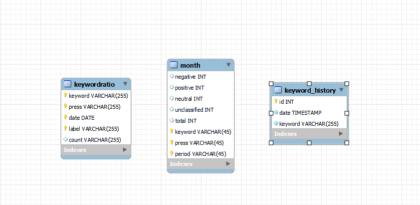
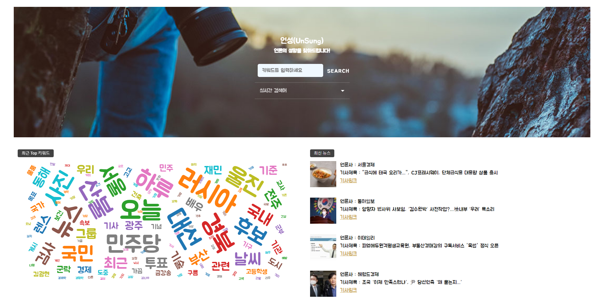
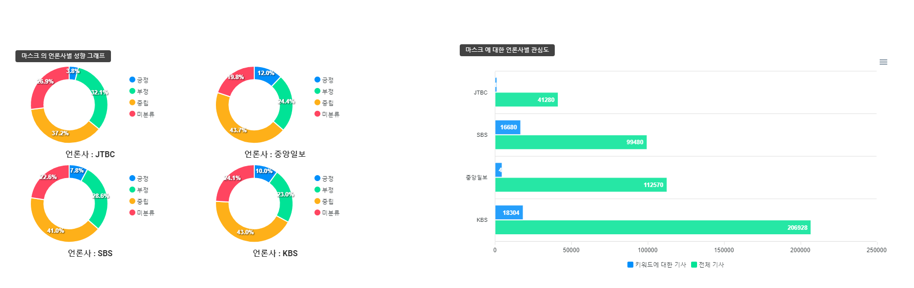
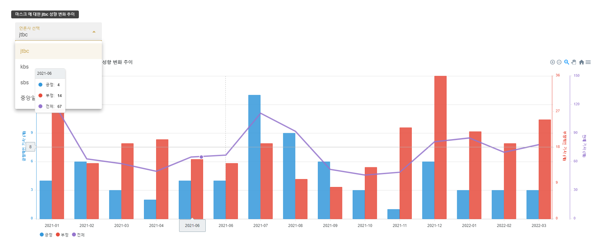

# Unsung 프로젝트

## Unsung 소개 및 시연 영상

시나리오가 궁금하면 [여기]()에서 확인할 수 있습니다.

## Overview

특정 키워드에 대한 뉴스 성향이 궁금하신가요? 
키워드에 관련된 뉴스만 모아서 보고싶으신가요? 
저희 **Unsung**에서 확인하실 수 있습니다.

## 팀 소개

|  Member  |    오서하     |  유우식   |    윤지영     |    이지순     |    허범    |
| :------: | :-----------: | :-------: | :-----------: | :-----------: | :--------: |
| Profile  |      |  |      |      |     |
| Position | Big Data & AI |    FE     | Big Data & AI | Big Data & AI | BE & Infra |

## 프로젝트 기간 - 2022.02.21 ~ 2022.04.08

### 주요기능

---

- 설명 : 키워드에 대한 주요 언론사 성향을 분석해서 다양한 지표로 제공
- 주요 기능 :
  - 특정 키워드에 대한 언론사 성향을 분석해서 다양한 그래프로 제공
  - 키워드 관련 뉴스를 빅데이터를 이용해 제공
  - 사용자가 검색한 실시간 검색어를 제공
  - 언론사에서 주로 다뤄지는 키워드를 워드클라우드로 제공

### 개발 환경

---

**Backend**

- IntelliJ 
- Spring Boot 2.6.5 
- Spring Boot JPA
- JAVA 8 
- MySQL 
- AWS EC2 
- Hadoop
- Spark
- Spark Streaming
- Kafka
- HDFS
- Bert
- TF-IDF
- Sqoop

**Frontend**

- Visual Studio Code 
- Vue 

**CI/CD**

- AWS EC2 
- Docker 
- Nginx 

**협업 툴**

- Git 
- Jira 
- Notion 
- Mattermost 
- Webex
- Discord 

### Git Flow 브랜치 전략

---

- Git Flow Model을 사용하고, Git 기본 명령어를 사용한다.
- commit은 git-cz를 사용해서 commit한다.
- Git Flow 사용 브랜치
  - feature - 기능
  - develop - 개발
  - master - 배포
- Git Flow 진행 방식
  1. feature 브랜치가 완성되면 develop 브랜치로 pull request를 요청한다.
  2. pull request가 요청되면, 모든 팀원이 코드 리뷰를 하고 merge를 진행한다.
  3. 매주 금요일 develop 브랜치를 master 브랜치로 병합하여 배포를 진행한다.

### Jira

---

일정 및 효율적인 개발을 위해 Jira를 사용했습니다. 매주 금요일 미팅을 통해 다음 주에 진행될 주 단위 계획을 짜고 이슈들을 스프린트에 등록했습니다.
스프린트는 주 단위로 만들어 진행했습니다.

- Epic : 구현할 기능들을 큰 틀로 나누어서 구성하였습니다.
- Story : 세부 기능들을 작성하여 Epic을 지정하였습니다.

### Notion & Webex & Discord

---

Notion에서는 모두가 봐야할 공지, 미팅내용, 학습내용, 일정, 필수 링크들을 모아서 정리했습니다.

Webex와 Discord에서는 항상 모여서 개발을 진행하고, 회의를 진행했습니다.

### Scrum

---

매일 팀 미팅 이후에 팀원끼리 모여 시간을 가졌습니다. Scrum을 통해 팀원들의 진행 상황을 확인하고 꾸준히 모니터링 했습니다.

### ER Diagram

---

## Unsung 서비스 화면

1. 메인페이지
   
2. 키워드 검색 후 차트
   
   
